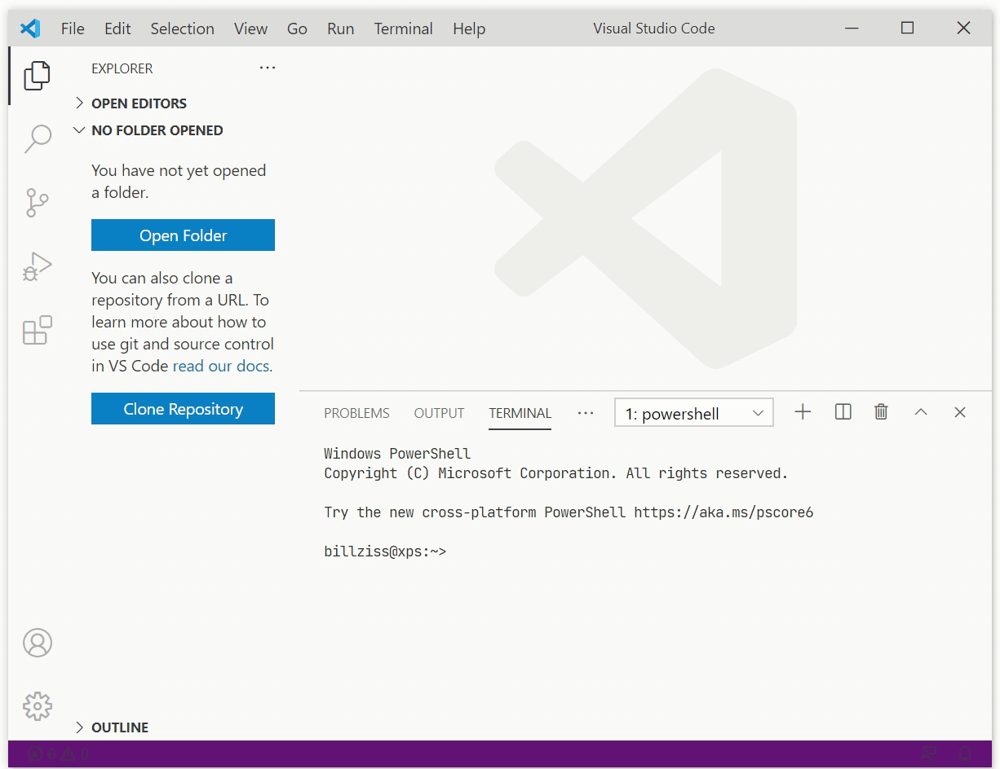
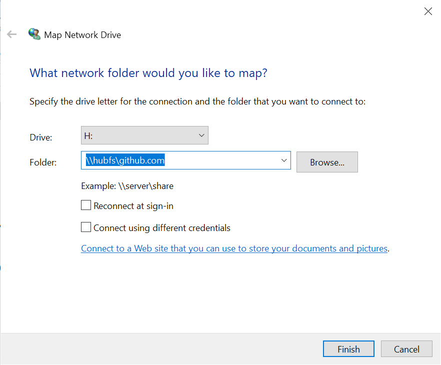

<h1 align="center">

<br/>
<br/>
HUBFS &middot; File System for GitHub
</h1>

<p align="center">
<a href="https://github.com/winfsp/hubfs/releases">

</a>

HUBFS is a file system for GitHub and Git. Git repositories and their contents are represented as regular directories and files and are accessible by any application, without the application having any knowledge that it is really accessing a remote Git repository. The repositories are writable and allow editing files and running build operations.
<br/>
<br/>

</p>

## How to use

HUBFS is a command-line program with a usage documented below. On Windows there is also good desktop integration so that you can use HUBFS without the command line.

HUBFS supports both authenticated and non-authenticated access to repositories. When using HUBFS without authentication, only public repositories are available. When using HUBFS with authentication, both public and private repositories become available; an additional benefit is that the rate limiting that GitHub does for certain operations is relaxed.

In order to mount HUBFS issue the command `hubfs MOUNTPOINT`. For example, `hubfs H:` on Windows or `hubfs mnt` on macOS and Linux.

The first time you run HUBFS you will be prompted to authorize it with GitHub:

```
> ./hubfs H:
First, copy your one-time code: XXXX-XXXX
Then press [Enter] to continue in the web browser...
```

HUBFS will then open your system browser where you will be able to authorize it with GitHub. HUBFS will store the resulting authorization token in the system keyring (Windows Credential Manager, macOS Keychain, etc.). Subsequent runs of HUBFS will use the authorization token from the system keyring and you will not be required to re-authorize the application.

To unmount the file system simply use <kbd>Ctrl-C</kbd>. On macOS and Linux you may also be able to unmount using `umount` or `fusermount -u`.

### Full command-line usage

The full HUBFS command line usage is as follows:

```
usage: hubfs [options] [remote] mountpoint

  -auth method
        method is from list below; auth tokens are stored in system keyring
        - force     perform interactive auth even if token present
        - full      perform interactive auth if token not present (default)
        - required  auth token required to be present
        - optional  auth token will be used if present
        - none      do not use auth token even if present
        - token=T   use specified auth token T; do not use system keyring
  -authkey name
        name of key that stores auth token in system keyring
  -authonly
        perform auth only; do not mount
  -d    debug output
  -filter rules
        list of rules that determine repo availability
        - list form: rule1,rule2,...
        - rule form: [+-]owner or [+-]owner/repo
        - rule is include (+) or exclude (-) (default: include)
        - rule owner/repo can use wildcards for pattern matching
  -o options
        FUSE mount options
        (default: uid=-1,gid=-1,rellinks,FileInfoTimeout=-1)
  -version
        print version information
```

(The default FUSE mount options depend on the OS. The `uid=-1,gid=-1` option specifies that the owner/group of HUBFS files is determined by the user/group that launches the file system. This works on Windows, Linux and macOS.)

### File system representation

By default HUBFS presents the following file system hierarchy: / *owner* / *repository* / *ref* / *path*

- *Owner* represents the owner of repositories under GitHub. It may be a user or organization. An *owner* is presented as a subdirectory of the root directory and contains *repositories*. However the root directory cannot be listed, because there are far too many owners to list.

- *Repository* represents a repository owned by an *owner*. A *repository* is presented as a directory that contains *refs*.

- *Ref* represents a git "ref". It may be a git branch, a git tag or even a commit hash. A *ref* is presented as a directory that contains repository content. However when listing a *repository* directory only branch *refs* are listed.

- *Path* is a path to actual file content within the repository.

HUBFS interprets submodules as symlinks. These submodules can be followed if they point to other GitHub repositories. General repository symlinks should work as well. (On Windows you must use the FUSE option `rellinks` for this to work correctly.)

With release 2022 Beta1 HUBFS *ref* directories are now writable. This is implemented as a union file system that overlays a read-write local file system over the read-only Git content. This scheme allows files to be edited and builds to be performed. A special file named `.keep` is created at the *ref* root (full path: / *owner* / *repository* / *ref* / `.keep`). When the edit/build modifications are no longer required the `.keep` file may be deleted and the *ref* root will be garbage collected when not in use (i.e. when no files are open in it -- having a terminal window open with a current directory inside a *ref* root counts as an open file and the *ref* will not be garbage collected).

### Windows integration

When you use the MSI installer under Windows there is better integration of HUBFS with the rest of the system:

- There is a "Start Menu > HUBFS > Perform GitHub auth" shortcut that allows you to authorize HUBFS with GitHub without using the command line.

- You can mount HUBFS drives using the Windows Explorer "Map Network Drive" functionality. To dismount use the "Disconnect Network Drive" functionality. (It is recommended to first authorize HUBFS with GitHub using the above mentioned shortcut.)

    

- You can also mount HUBFS with the `net use` command. The command `net use H: \\hubfs\github.com` will mount HUBFS as drive `H:`. The command `net use H: /delete` will dismount the `H:` drive.

## How to build

In order to build HUBFS run `make` from the project's root directory. On Windows you will have to run `.\make`. The build prerequisites for individual platforms are listed below:

- Windows: [Go 1.16](https://golang.org/dl/), [WinFsp](https://github.com/winfsp/winfsp), gcc (e.g. from [Mingw-builds](http://mingw-w64.org/doku.php/download))

- macOS: [Go 1.16](https://golang.org/dl/), [FUSE for macOS](https://osxfuse.github.io), [command line tools](https://developer.apple.com/library/content/technotes/tn2339/_index.html)

- Linux: Prerequisites: [Go 1.16](https://golang.org/dl/), libfuse-dev, gcc

## How it works

HUBFS is a cross-platform file system written in Go. Under the hood it uses [cgofuse](https://github.com/winfsp/cgofuse) over either [WinFsp](https://github.com/winfsp/winfsp) on Windows, [macFUSE](https://osxfuse.github.io/) on macOS or [libfuse](https://github.com/libfuse/libfuse/) on Linux. It also uses [go-git](https://github.com/go-git/go-git) for some git functionality.

HUBFS interfaces with GitHub using the [REST API](https://docs.github.com/en/rest). The REST API is used to discover owners and repositories in the file system hierarchy, but is not used to access repository content. The REST API is rate limited ([details](https://docs.github.com/en/rest/overview/resources-in-the-rest-api#rate-limiting)).

HUBFS uses the git [pack protocol](https://git-scm.com/docs/pack-protocol) to access repository content. This is the same protocol that git uses during operations like `git clone`. HUBFS uses some of the newer capabilities of the pack protocol that allow it to fetch content on demand. HUBFS does not have to see all of the repository history or download all of the repository content. It will only download the commits, trees and blobs necessary to back the directories and files that the user is interested in. Note that the git pack protocol is not rate limited.

HUBFS caches information in memory and on local disk to avoid the need to contact the servers too often.

### Git pack protocol use

HUBFS uses the git pack protocol to fetch repository refs and objects. When HUBFS first connects to the Git server it fetches all of the server's advertised refs. HUBFS exposes these refs as subdirectories of a repository.

When accessing the content of a ref for the first time, the commit object pointed by the ref is fetched, then the tree object pointed by the commit is fetched. When fetching a tree HUBFS will also fetch all blobs directly referenced by the tree, this is required to compute proper `stat` data (esp. size) for files.

HUBFS fetches objects with a depth of 1 and a filter of `tree:0`. This ensures that the git server will only send objects whose hashes have been explicitly requested. This avoids sending extraneous information and speeds up communication with the server.

## Security issues

- Consider a program that accesses files under `/COMMON-NAME/DIR`. The owner of the `COMMON-NAME` GitHub account could create a repository named `DIR` and inject arbitrary file content into the program's process. This problem is particularly important when mounting the file system as a drive on Windows. To fix this problem:

    - Run HUBFS with the `-filter` option. For example, running HUBFS with `-filter ORG` will make available the repositories in `ORG` only. Files within the file system will be accessible as / `ORG` / *repository* / *ref* / *path*. (The `-filter` option allows the inclusion/exclusion of multiple repositories and supports wildcard syntax. Please see the HUBFS usage for more.)

	- Run HUBFS with a "prefix". For example, the (Windows) command line `./hubfs github.com/ORG H:` will place the root of the file system within `ORG` and thus make available the repositories in `ORG` only. Files within the file system will be accessible as / *repository* / *ref* / *path*.

## Potential future improvements

- The file system does not present a `.git` subdirectory. It may be worthwhile to present a virtual `.git` directory so that simple Git commands (like `git status`) would work.

- Additional providers such as GitHub Enterprise, BitBucket, GitLab, etc.

## License

This project is licensed under the [GNU Affero General Public License version 3](License.txt).